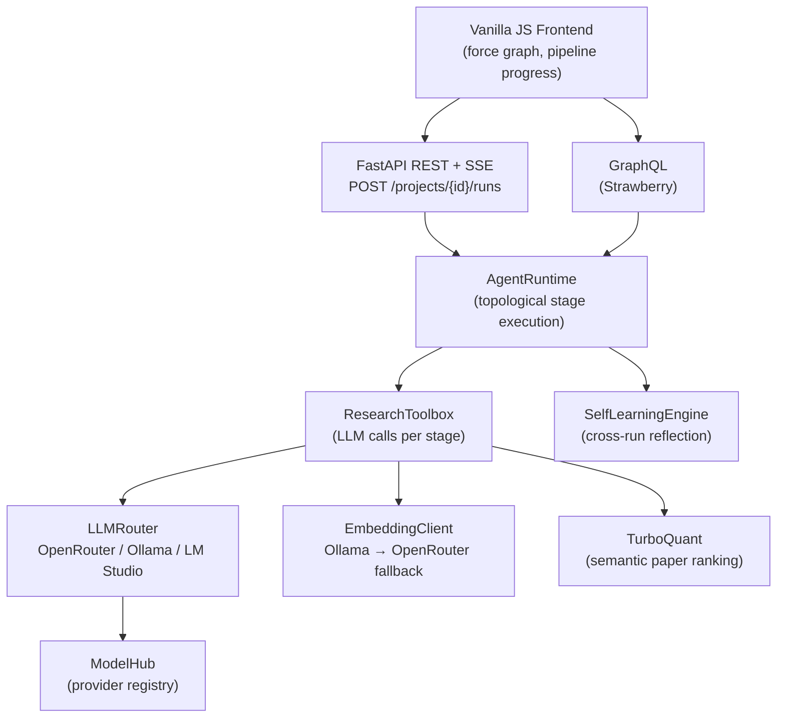

<h1 align="center">ResearchGraph</h1>

<p align="center"><em>Graph-native autonomous research operating system — survey, gap analysis, novelty synthesis, experiment execution, and report generation.</em></p>

<p align="center">
  
  
  
  
</p>

---

## Overview

ResearchGraph is a self-contained research operating system. Give it a domain and problem statement — it surveys the literature, identifies gaps, synthesizes novel ideas, runs experiments, and writes a full research report, with no further input required.

Every artefact — papers, agents, experiments, report sections, technologies — is a first-class graph node. Eight live graph projections build incrementally during a run and are queryable via both REST and GraphQL.

---

## Pipeline

```
Intake → Evidence Scout → Planning Graph → Survey →
Planner → Critic → Grounding → Novelty → Coordinator →
Judge → Code Generation → Experiment Operator → Memory → Writer
```

Each stage writes typed artefacts to the run object. The frontend polls live and animates nodes as they arrive.

### Agent roster

| Agent | Role | Key outputs |
|---|---|---|
| **Intake** | Problem framing | `research_brief` |
| **Evidence Scout** | Literature discovery | `paper_graph` |
| **Planning Graph** | Task decomposition | `task_graph`, `decision_graph` |
| **Survey** | Literature synthesis | `literature_survey`, `gap_analysis` |
| **Planner** | Proposal generation | `proposal_options`, `implementation_plan` |
| **Critic** | Adversarial review | `critique_report` |
| **Grounding** | Evidence verification | `grounding_report` |
| **Novelty Critic** | Novelty scoring | `novelty_hypotheses` |
| **Coordination Router** | Weighted voting | `coordination_topology`, `vote_board` |
| **Judge** | Final decision | `judged_decision`, `decision_summary` |
| **Code Generation** | Experiment scaffold | `codegen_result` |
| **Experiment Operator** | Execution & metrics | `experiment_results` |
| **Memory Steward** | Reflexive memory graph | `memory_graph`, `evidence_context` |
| **Writer** | Report & paper draft | `report_graph`, `paper_draft`, `final_report` |

---

## Architecture



### Graph projections

Eight live projections of each run are exposed via `/api/runs/{id}/graphs/{kind}` and `/api/projects/{id}/graphs/{kind}`:

| Kind | What it shows |
|---|---|
| `unified` | All nodes and relationships |
| `papers` | Citation and evidence network |
| `agents` | Pipeline agent flow |
| `experiments` | Experiment design and results |
| `reports` | Report section structure |
| `learning` | Cross-run lessons and model reliability |
| `technology` | Methods, tools, and technology landscape |
| `agentic` | Taxonomy of agentic capabilities |

---

## Quick Start

```bash
git clone https://github.com/Gustav-Proxi/ResearchGraph
cd ResearchGraph
python3 -m venv .venv && source .venv/bin/activate
pip install -e .
research-graph-api
# → http://127.0.0.1:8080
```

### API keys

```bash
export OPENROUTER_API_KEY=sk-or-...        # required for LLM calls
export SEMANTIC_SCHOLAR_API_KEY=...        # optional — raises rate limits
```

Or create a `.env` file in the project root (gitignored). The OpenRouter key can also be pasted in the **Settings** tab of the UI — it is stored in memory only and does not persist to disk.

### Model providers

Configure in the **Settings** tab. No key required for local providers.

| Provider | Default endpoint |
|---|---|
| **OpenRouter** | `openrouter` — default model `openai/gpt-4.1` |
| **Ollama** | `http://127.0.0.1:11434` — auto-detected |
| **LM Studio** | `http://127.0.0.1:1234/v1` — OpenAI-compatible |
| **Custom** | Any OpenAI-compatible endpoint |

---

## REST API

```
GET    /health
GET    /api/projects
POST   /api/projects
GET    /api/projects/{id}
DELETE /api/projects/{id}
GET    /api/projects/{id}/graphs/{kind}
POST   /api/projects/{id}/runs
GET    /api/projects/{id}/runs
POST   /api/projects/{id}/papers
POST   /api/projects/{id}/papers/arxiv
POST   /api/projects/{id}/papers/upload
GET    /api/projects/{id}/top-papers
GET    /api/projects/{id}/learning
POST   /api/projects/{id}/expand-citations
GET    /api/projects/{id}/novelty
GET    /api/runs/{id}
GET    /api/runs/{id}/graphs/{kind}
GET    /api/runs/{id}/stream               # SSE live updates
POST   /api/runs/{id}/approve              # human-in-the-loop approval
POST   /api/runs/{id}/resume
DELETE /api/runs
GET    /api/runs/{id}/export?format=md|latex
GET    /api/learning/global
POST   /api/learning/transfer
GET    /api/models/settings
POST   /api/models/settings
GET    /api/models/ollama
POST   /api/models/ollama/connect
POST   /api/models/ollama/install
GET    /api/models/install-jobs
POST   /api/models/custom
/graphql                                   # Strawberry GraphQL endpoint
```

---

## Project Structure

| Path | Purpose |
|---|---|
| `src/research_graph/app.py` | FastAPI routes and server entrypoint |
| `src/research_graph/service.py` | Orchestration service, run lifecycle |
| `src/research_graph/runtime.py` | `AgentRuntime` — topological stage execution |
| `src/research_graph/tools.py` | Stage artefact generators with LLM calls |
| `src/research_graph/graphs.py` | Eight graph builders + incremental live graph |
| `src/research_graph/schema.py` | Strawberry GraphQL schema |
| `src/research_graph/paper_search.py` | Semantic Scholar + arXiv search with caching |
| `src/research_graph/arxiv_search.py` | arXiv Atom feed search (no key required) |
| `src/research_graph/embeddings.py` | Embedding client (Ollama → OpenRouter fallback) |
| `src/research_graph/llm_router.py` | LLM routing across providers |
| `src/research_graph/model_hub.py` | Provider registry and local model installs |
| `src/research_graph/learning.py` | `SelfLearningEngine` — cross-run reflection |
| `src/research_graph/turboquant.py` | Semantic paper ranking via cosine similarity |
| `src/research_graph/seed.py` | Demo project and full pipeline definition |
| `src/research_graph/export.py` | Markdown and LaTeX report export |
| `src/research_graph/static/` | Frontend (index.html, app.js, styles.css) |
| `docs/agentic_blueprint.md` | Agentic taxonomy and design rationale |

---

## Design Notes

- **Self-learning** — lessons and policies from each run are persisted to `data/self_learning.json` and injected into subsequent runs as stage-level guidance.
- **Human-in-the-loop** — runs can pause at the Judge stage (`human_approval=true`) and resume after a `POST /api/runs/{id}/approve` call.
- **State** — run state is in-memory; restarts lose active runs by design. Self-learning state and model hub persist to disk.
- **Typical run** — ~14 LLM calls (one per stage), 2–4 min on OpenRouter.
- **Paper ingestion** — arXiv URLs, bare arXiv IDs, and PDF uploads are all supported via the REST API.
- **Never write keys to `data/model_hub.json`** — that file is gitignored precisely to prevent accidental commits.

---

## Agentic Taxonomy

The system's agentic layer is grounded in Bei et al. (2025), *Graphs Meet AI Agents: Taxonomy, Progress, and Future Opportunities* ([arXiv:2506.18019](https://arxiv.org/abs/2506.18019)). The four core facets — planning, execution, memory, and multi-agent coordination — are first-class objects in the system, alongside three forward-looking directions: Graph Foundation Models, Model Context Protocol, and Open Agent Networks.

---

## License

No license file is present in this repository.
